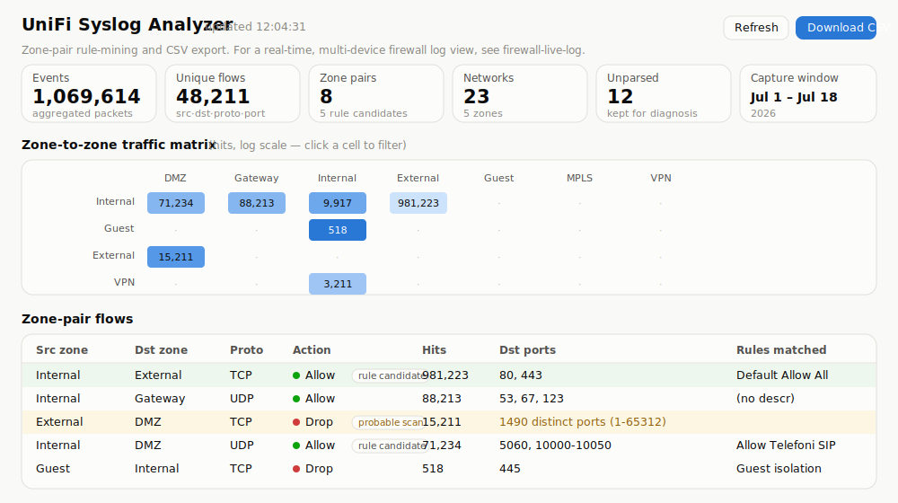

# unifi-syslog-analyzer

Turn a UniFi gateway's firewall syslog into a **zone-to-zone traffic
report** you can write firewall rules from — web dashboard, JSON API,
and CSV export. Built for the job of replacing broad "Allow All"
zone-pair policies with minimal explicit rules based on what actually
talks to what.

- **Zero dependencies** — pure Python 3 standard library, one container.
- **Networks enumerated via the UniFi API** (names, VLAN IDs, subnets,
  gateway IPs), with zone membership from the zone-based-firewall API
  when available; nothing hardcoded. A static JSON table works too — for
  non-UniFi, netfilter-based firewalls.
- **Aggregates at ingest**: one row per unique (src, dst, proto, port,
  rule) with hit counters, flushed every 5 s. The database stays in the
  tens of MB no matter how long you capture.
- **Loss-safe**: SIGTERM (container stop/restart) triggers a final flush.
- **Dashboard**: zone matrix heatmap, filterable flow table, rule
  candidates highlighted, port-scan noise flagged, light/dark theme.
- **CSV download** of the consolidated report, any time — safe to use
  mid-capture.

> Looking for a real-time, multi-device firewall log (UniFi **and** Sophos,
> green/red allow-block, per-device)? That's the companion project
> [firewall-live-log](https://github.com/g-guglielmi/firewall-live-log).
> This repo is the batch rule-mining tool; that one is the always-on live
> view.

## Screenshot

The dashboard: KPI tiles, the zone-to-zone traffic matrix (log-scaled
heatmap, click a cell to filter), and the zone-pair flow table with rule
candidates highlighted green and probable scans flagged amber.



<sub>Preview rendered with sample data.</sub>

## Quick start

Prebuilt multi-arch images (amd64/arm64) are published to GHCR on every
release tag:

```sh
docker run -d --name unifi-syslog-analyzer --restart unless-stopped \
  -p 5514:5514/udp -p 8080:8080 \
  -v unifi-syslog-data:/data \
  -e UNIFI_HOST=https://192.168.1.1 \
  -e UNIFI_API_KEY='your-api-key' \
  ghcr.io/g-guglielmi/unifi-syslog-analyzer:latest
```

Pin a version for reproducible deployments:
`ghcr.io/g-guglielmi/unifi-syslog-analyzer:v0.0.1` (all versions under
[Packages](https://github.com/g-guglielmi/unifi-syslog-analyzer/pkgs/container/unifi-syslog-analyzer)).
Building locally still works if you prefer:
`docker build -t unifi-syslog-analyzer https://github.com/g-guglielmi/unifi-syslog-analyzer.git`

Then:

1. Open the dashboard at `http://<docker-host>:8080` — the Networks
   panel should list your VLANs with zones within a few seconds.
2. Point the gateway's syslog at the container. On UniFi OS consoles:
   **Settings → CyberSecure → Traffic Logging** → Flow Logging =
   **All Traffic** → Activity Logging (Syslog) → **SIEM Server** →
   `<docker-host>`, port `5514`.
3. Watch traffic appear. Collect for one to two weeks before writing
   rules; download the CSV whenever you like.

## Controller authentication

**Use an API key.** On the console: **Admins & Users → (your admin) →
Create API key** (older UIs: Control Plane → Integrations), then pass it
as `UNIFI_API_KEY`. Keys are revocable, don't expire your session, and —
crucially — are the **only mechanism that works when MFA is enforced**
(fabric-joined / UniFi Identity consoles enforce MFA on every account,
which makes password logins to the API impossible). Prefer creating the
key under a dedicated admin with **read-only** network permissions.

`UNIFI_USER` + `UNIFI_PASS` remain as a fallback for local accounts
without MFA and for legacy self-hosted controllers (`:8443`) that
predate API keys. If a password login is rejected with 401, the log
tells you to switch to an API key.

## Configuration (environment variables)

| Variable | Default | Purpose |
|---|---|---|
| `UNIFI_HOST` | — | Controller URL (`https://192.168.1.1`, or `https://host:8443` for legacy self-hosted). Unset = no API enumeration. |
| `UNIFI_API_KEY` | — | Local API key (preferred; required when MFA is enforced). |
| `UNIFI_USER` / `UNIFI_PASS` | — | Password fallback (non-MFA local admin only). |
| `UNIFI_SITE` | `default` | Site name (the `s/<site>` part of controller URLs). |
| `UNIFI_VERIFY_SSL` | `false` | Set `true` if the controller has a valid certificate. |
| `NETWORKS_REFRESH_MIN` | `60` | Minutes between re-enumerations. |
| `NETWORKS_JSON` | — | Path to a static network table (see below). |
| `SYSLOG_PORT` / `SYSLOG_BIND` | `5514` / `0.0.0.0` | UDP listener. |
| `HTTP_PORT` / `HTTP_BIND` | `8080` / `0.0.0.0` | Dashboard/API. |
| `DB_PATH` | `/data/flows.db` | SQLite location (put it on the volume). |
| `UNPARSED_CAP` | `10000` | Max raw unparseable lines kept for diagnosis. |

## Static network table (non-UniFi firewalls)

Any netfilter-based firewall that logs `SRC= DST= PROTO= DPT=` lines can
be analyzed. Skip the `UNIFI_*` variables and mount a JSON table instead:

```sh
docker run -d ... \
  -v /path/to/networks.json:/data/networks.json:ro \
  -e NETWORKS_JSON=/data/networks.json \
  unifi-syslog-analyzer
```

```json
[
  {"name": "LAN",     "vlan_id": 1,  "cidr": "192.168.1.0/24", "zone": "Internal", "gateway_ip": "192.168.1.1"},
  {"name": "Servers", "vlan_id": 20, "cidr": "192.168.20.0/24", "zone": "Internal"},
  {"name": "Guest",   "vlan_id": 30, "cidr": "192.168.30.0/24", "zone": "Guest"}
]
```

`zone` is free-form — group networks however you plan to write rules.
Both sources can be combined (manual entries win on longer prefixes).

## How zones are resolved

Flows are stored as **raw IPs**; zone resolution happens when a report is
built. So an incomplete network table is never fatal: fix the table (or
let the next API refresh pick up a new VLAN) and the whole history is
re-attributed on the next report.

| Match | Zone |
|---|---|
| Exact gateway IP of a network | `Gateway` (the firewall itself) |
| Longest-prefix network match | that network's zone |
| Multicast / broadcast | `Multicast` / `Broadcast` |
| Unmatched public IP | `External` |
| Anything else | `Unknown` (table incomplete — fix, don't guess) |

Zone membership prefers the zone-based-firewall API (Network ≥ 9.0);
otherwise it falls back to the network `purpose` field (corporate →
Internal, guest → Guest, VPN purposes → VPN).

## Reading the report

- **Rule candidates** (green rows): `Allow` traffic between known zones,
  not scan-flagged. One explicit zone-pair rule per row, using the
  consolidated port ranges (e.g. an RTP range shows as `10000-10050`,
  not 51 rows).
- **Rules matched** shows which existing firewall rule the traffic hit —
  traffic already covered by a specific policy needs no new rule; the
  interesting rows are the ones riding a catch-all.
- **Probable scan** rows (>100 distinct ports) are noise/hostility, not
  rule material.
- **Unknown** zone rows mean the network table doesn't cover those IPs.
- After tightening rules, keep collecting and watch **Drop/Block** rows
  for legitimate monthly/quarterly jobs your capture window missed.

## API

| Endpoint | Description |
|---|---|
| `GET /api/report` | Zone-pair groups (JSON). |
| `GET /api/report.csv` | Same as CSV download. |
| `GET /api/summary` | Counters, capture window, listener stats. |
| `GET /api/networks` | The enumerated/static network table. |
| `GET /api/unparsed?limit=25` | Raw samples of unparseable lines. |
| `POST /api/refresh-networks` | Re-enumerate from the controller now. |

## Testing

The image ships with a synthetic end-to-end harness (no external
network needed):

```sh
docker run --rm ghcr.io/g-guglielmi/unifi-syslog-analyzer:latest python3 /app/test_harness.py
```

The same harness runs in CI on every push and as a gate in the release
workflow — an image only reaches GHCR if all checks pass. It also runs
directly on Windows/Linux/macOS with plain `python3 test_harness.py`.

It boots the real app, replays synthetic SIP/RTP/DNS/SMB/scan traffic,
verifies aggregation, port-range consolidation, scan flagging, the CSV
export, and that a SIGTERM mid-batch loses no data.

## Security notes

- The dashboard has **no authentication**. Run it on a management
  network, or put a reverse proxy with auth in front of it.
- The controller API key (or password) arrives via environment variable;
  scope it to a dedicated read-only admin, and treat the host's Docker
  config accordingly. Revoke the key on the console if the host is ever
  compromised.
- `UNIFI_VERIFY_SSL` defaults to off because controllers ship
  self-signed certificates; turn it on if yours has a real one.
- Firewall logs are metadata about your network — the SQLite volume
  deserves the same care as the logs themselves.

## Operations

- **UDP buffer**: at startup the listener logs the granted receive
  buffer. On busy networks raise it on the *host*:
  `sysctl -w net.core.rmem_max=8388608` (containers inherit it).
- **Unparsed lines**: a steadily climbing "Unparsed" tile means the log
  format differs from expectations — the dashboard's Unparsed panel
  shows raw samples; please open an issue with a couple of them.
- The database persists in the `/data` volume across container
  upgrades; delete the volume to start a fresh capture.

## License

[MIT](LICENSE)
